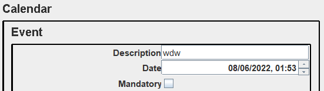

# XML Parser

This project has 2 main modules:
1. **xmlparser.core** - Standalone library that creates and edits xml documents with packages/classes/methods well documented.
2. **xmlparser.editor** - A graphical user interface that helps to edit a xml document. It uses the xmlparse.core library and its highly extendable using plugins.  

***

## xmlparser.core
### Basic usage
First we need to create a xml context, we can do that with the following code:
```kotlin
val xmlContext: XmlContext = XmlContext()
```
A xml file must have a root/principal node, we can create a xml element and set it as the root element.
We can do this by:
```kotlin
val rootElement: XmlElement = XmlElement(name = "Root")
xmlContext.rootXmlElement = rootElement
```
To dump a xml context we can do the following:
```kotlin
xmlContext.dump() // or toString()
```
### Xml Elements and Attributes
A xml element is a something commonly known as a xml tag, this is a xml element:
````xml
<element></element>
````
A xml element can have a value:
````xml
<element>Value Xml Element</element>
````
And multiple attributes:
````xml
<element attribute1="valueAttribute2" attribute2="valueAttribute2"></element>
````
A xml element can also have a child or multiple children:
````xml
<element>
    <child></child>
</element>
````
To create a xml element we need to instantiate the XmlElement class:
```kotlin
val xmlElement: XmlElement = XmlElement("name", "value")
```
We can add an attribute to a xmlElement like this:
```kotlin
val xmlAttribute: XmlAttribute = XmlAttribute("attributeName", "attributeValue")
xmlElement.addAttribute(xmlAttribute)
```
We can a child to a xml element this way:
```kotlin
val xmlElementChild: XmlElement = XmlElement("child", "valueChild")
xmlElement.addChild(xmlElementChild) // or xmlElement.addChild("child", "valueChild")
```
### Visiting and observing
A xml context is visitable and observable.

### Standard Containers Support
xmlparser.core supports:
1. Arrays
2. Classes that implement iterable(set and list)
3. Maps

Example:
```kotlin
val list = listOf(1, 2, 3)
val element = XmlElement(list, name = "iterable")
xmlContext.rootXmlElement = element
```
This way, the context will be:
```xml
<?xml version="1.0" encoding="UTF-8" standalone="no"?>
<iterable>
    <item>1</item>
    <item>2</item>
    <item>3</item>
</iterable>
```
### Serializing classes - Reflection
In xmlparser.core it's very easy to serialize custom classes.
But first, let's see the available annotations that we can use to better customize the behaviour of the serialization.

| Name                | Usage                        |
|---------------------|------------------------------|
| XmlElementName      | Name of the element          |
| XmlElementContent   | Content of the element       |
| XmlElementIgnore    | This element will be ignored |
| XmlElementAttribute | Attribute of the element     |

Example of usage of the annotations when serializing a custom class.
```kotlin
private data class Entity(private val id: Int, val name: String)

private data class Point(val x: Int, val y: Int)

@XmlElementName("ComplexEntity")
private class Complex {
    @XmlElementContent
    val data: String = "Data Example"
    @XmlElementIgnore
    val ignore: String = "Element to ignore"
    @XmlElementAttribute
    val attribute1: String = "Attribute content"
    @XmlElementAttribute
    @XmlElementName("SpecialAttribute")
    val attribute2: String = "Attribute content"

    private val entity: Entity = Entity(1, "1")
    private val point: Point = Point(1,1)
    private val id: Int = 1
    @XmlElementName("maps")
    val map: Map<Int, Point> = mapOf(Pair(0, Point(0, 0)), Pair(1, Point(1, 1)))
}
```
Serialization:
```kotlin
val complex = Complex()
xmlContext.rootXmlElement = XmlElement(complex)
```
Result:
```xml
<?xml version="1.0" encoding="UTF-8" standalone="no"?>
<ComplexEntity attribute1="Attribute content" SpecialAttribute="Attribute content">Data Example
    <entity>
        <id>1</id>
        <name>1</name>
    </entity>
    <id>1</id>
    <maps>
        <item>
            <key>0</key>
            <value>
                <x>0</x>
                <y>0</y>
            </value>
        </item>
        <item>
            <key>1</key>
            <value>
                <x>1</x>
                <y>1</y>
            </value>
        </item>
    </maps>
    <point>
        <x>1</x>
        <y>1</y>
    </point>
</ComplexEntity>
```
## xmlparser.editor
### How to write plugins
xmlparser.editor is highly extensible. 
We can customize and add new functionalities to the core editor.
We have 2 interfaces we can implement to add new functionalities to the application.

| Name       | Definition                                                              |
|------------|-------------------------------------------------------------------------|
| IComponent | Represents a UI component                                               |
| IMenuItem  | Represents a menu item                                                  |
| IAction    | Represents a Command/Action that can be implemented and used in plugins |

#### IComponent
This interface looks like this:
```kotlin
interface IComponent<T1 : AbstractContextView<T1>, T2 : Component> {
    /**
     * Condition to accept.
     */
    fun accept(view: T1): Boolean = true

    /**
     * Gets the component.
     */
    fun component(view: T1): T2?
}
```
The accept function is used to know if the component should be applied in a context.
The function component will return the component to be drawn on the editor.
```kotlin
class DateAttributeComponent: IComponent<AttributeView, JPanel>
{
    override fun accept(view: AttributeView): Boolean {
        return view.xmlAttribute.name == "Date" &&
                view.xmlElement.name == "Event"
    }
    
    override fun component(view: AttributeView): JPanel {
        val panel = JPanel()
        panel.layout = GridLayout(0,2)
        val label = JLabel(view.xmlAttribute.name)
        label.horizontalAlignment = SwingConstants.RIGHT
        panel.add(label)

        val date = SimpleDateFormat("EEE MMM dd HH:mm:ss z yyyy").parse(view.xmlAttribute.value)
        val jSpinner = JSpinner(SpinnerDateModel(date,
            null, null, Calendar.MINUTE))
        jSpinner.addChangeListener {
            val value = jSpinner.value.toString()
            ActionStack.doAction(
                EditAttributeValueAction(
                    view.xmlAttribute,
                    value
                )
            )
        }
        panel.add(jSpinner)
        return panel
    }

}
```
In this example, this component will be used in an attribute view if the name of the attribute is "Date" and if the xml element of the attribute is "Event".
It will return a JPanel with special field made to edit a date.
With this plugin and others we could make something like this:


In examples.plugins we have some examples that further explain the usage.

#### IMenuItem
This interface looks like this:
```kotlin
interface IMenuItem<T1 : AbstractContextView<T1>> {
    /**
     * Condition to accept.
     */
    fun accept(view: T1): Boolean = true
    /**
     * Gets the menu item.
     */
    fun menuItem(view: T1): JMenuItem
}
```
The accept function is used to know if the component should be applied in a context.
The function menuItem will return the component to be available on the editor.

```kotlin
class AddPointMenuItem : IMenuItem<ElementView>
{

    override fun accept(view: ElementView): Boolean = view.xmlElement.name != "Point"

    override fun menuItem(view: ElementView): JMenuItem {
        val jMenuItem = JMenuItem("Add Point")
        jMenuItem.addActionListener {
            val xField = JTextField(5)
            val yField = JTextField(5)

            val jPanel = JPanel()

            jPanel.add(JLabel("x:"))
            jPanel.add(xField)
            jPanel.add(Box.createHorizontalStrut(15))

            jPanel.add(JLabel("y:"))
            jPanel.add(yField)
            val result = JOptionPane.showConfirmDialog(
                null, jPanel,
                "Please Enter X and Y Values", JOptionPane.OK_CANCEL_OPTION
            )
            if (result == JOptionPane.OK_OPTION) {
                if(xField.text == "")
                {
                    JOptionPane.showMessageDialog(view, "Invalid x value")
                    return@addActionListener
                }
                if(yField.text == "")
                {
                    JOptionPane.showMessageDialog(view, "Invalid y value")
                    return@addActionListener
                }

                try
                {
                    Integer.parseInt(xField.text)
                }
                catch (exception: Exception)
                {
                    JOptionPane.showMessageDialog(view, "Invalid x value")
                    return@addActionListener
                }
                try
                {
                    Integer.parseInt(yField.text)
                }
                catch (exception: Exception)
                {
                    JOptionPane.showMessageDialog(view, "Invalid y value")
                    return@addActionListener
                }
                val xmlElement = XmlElement("Point")
                xmlElement.addChild("x", xField.text)
                xmlElement.addChild("y", yField.text)
                ActionStack.doAction(AddChildAction(view.xmlElement, xmlElement))
            }
        }
        return jMenuItem
    }

}
```
This class will create an option to create special xml element child called "Point" if the father is not called "Point".

In examples.plugins we have some examples that further explain the usage.

#### IAction
This interface looks like this:
```kotlin
interface IAction {
    /**
     * Action name.
     */
    val name: String

    /**
     * Executes action.
     */
    fun execute()

    /**
     * Undo the action
     */
    fun undo()
}
```
Can be used to create a custom action to use in plugins-